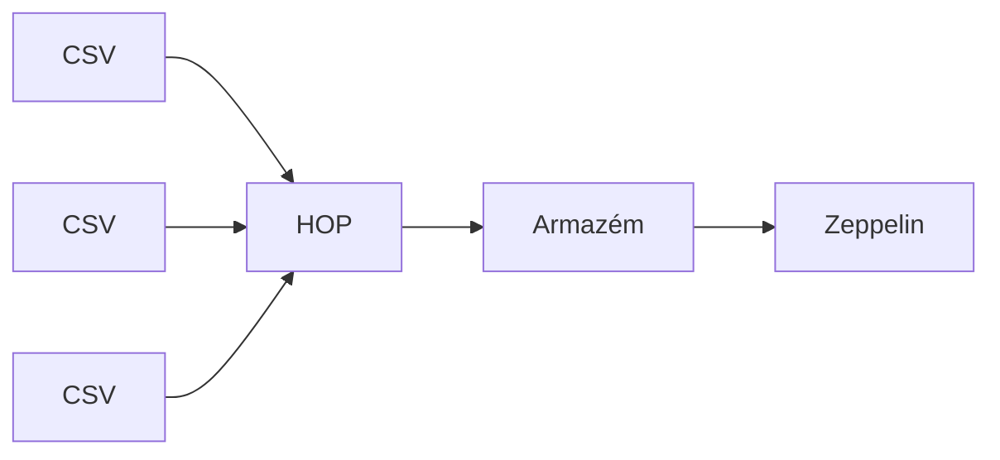

# Apache Hop: Simplificando Pipelines de Dados com ETL e ELT Low-Code
O Apache Hop (Hop Orchestration Platform) é uma poderosa plataforma open-source desenvolvida para facilitar a construção, automação e gerenciamento de pipelines de dados de forma ágil. Com uma abordagem low-code, permite que usuários criem fluxos de dados complexos sem a necessidade de programação extensa, utilizando uma interface visual intuitiva.

## ELT com Apache Hop: Carregamento de CSV e Análise de Dados

Neste artigo, apresentarei um processo simples utilizando o Apache Hop. O objetivo do projeto é carregar três arquivos CSV em um banco de dados PostgreSQL e, em seguida, utilizar o Apache Zeppelin para visualizar esses dados. Além disso, o processo de execução será automatizado com o Jenkins, permitindo o agendamento de tarefas de forma eficiente.




## Arquivos CSV

Os arquivos CSV que vamos carregar contêm dados referentes às vendas e estão estruturados da seguinte forma:

### 1. `produtos.csv` - Dados dos Produtos
Este arquivo contém informações detalhadas sobre os produtos disponíveis para venda. A estrutura das colunas é:

- **Codigo**: Código único do produto
- **CodigoBarras**: Código de barras do produto
- **Descricao**: Descrição do produto
- **CustoFinal**: Custo final do produto

**Exemplo de dados:**
| Codigo | CodigoBarras  | Descricao                    | CustoFinal |
|--------|---------------|------------------------------|------------|
| 1      | ,             | ACAFRAO 10GR  ALCONDI         | 0,265      |
| 2      | 7898197770485 | ACUCAR COLORIDO 30GR  ALCONDI | 0,367      |

### 2. `vendas.csv` - Dados das Vendas
Este arquivo registra as informações das vendas realizadas, como a data, hora e o valor total do pedido. As colunas são:

- **Codigo**: Código da venda
- **Data**: Data da venda
- **Hora**: Hora da venda
- **TotalPedido**: Valor total do pedido

**Exemplo de dados:**
| Codigo | Data       | Hora     | TotalPedido |
|--------|------------|----------|-------------|
| 1      | 2022-12-21 | 10:42:06 | 0           |
| 2      | 2023-02-04 | 08:44:00 | 163,57      |

### 3. `vendasprodutos.csv` - Produtos Vinculados às Vendas
Este arquivo vincula os produtos vendidos com as vendas, incluindo a quantidade e o preço de cada produto na venda. As colunas são:

- **CodigoVenda**: Código da venda
- **CodigoProduto**: Código do produto
- **CodigoBarras**: Código de barras do produto
- **Descricao**: Descrição do produto
- **Quantidade**: Quantidade vendida
- **ValorCusto**: Valor de custo do produto
- **ValorUnitario**: Valor unitário do produto na venda

**Exemplo de dados:**
| CodigoVenda | CodigoProduto | CodigoBarras  | Descricao                     | Quantidade | ValorCusto | ValorUnitario |
|-------------|---------------|---------------|-------------------------------|------------|------------|---------------|
| 1725        | 170           | 7897090139382 | ACAFRAO CURCUMA MOIDA 55GR     | 1          | 2,136      | 5             |
| 2           | 265           | 7897090136015 | SAL DE PARRILLA 1KG            | 10         | 4,6        | 16,357        |

# Apache Hop: Integrando Dados CSV com PostgreSQL

Nesta seção, vamos descrever o processo de integração de dados CSV com o banco de dados PostgreSQL, utilizando o Apache Hop. O objetivo é automatizar a carga e atualização de dados provenientes de três arquivos CSV em tabelas do PostgreSQL, assegurando que qualquer alteração nos arquivos seja refletida no banco de dados.

## Processo de Integração com Apache Hop


### Visão Geral do Processo
Conforme mostrado na imagem acima, o processo de ETL foi configurado para realizar as seguintes etapas:

1. **Carregamento de Arquivos CSV**: 
   - Utilizamos três arquivos CSV contendo informações de produtos, vendas e produtos vendidos em cada venda.
   
2. **Tipagem e Seleção de Campos**: 
   - Cada arquivo CSV é processado pelo nó `Select Values`, onde os campos são selecionados e a tipagem dos dados é ajustada para garantir compatibilidade com as colunas do banco de dados PostgreSQL.

3. **Conexão com o PostgreSQL**:
   - Foi estabelecida uma conexão com o banco de dados PostgreSQL, utilizando as credenciais de acesso (host, porta, usuário e senha).
   
4. **Inserção e Atualização de Dados (`Insert/Update`)**:
   - Utilizamos a função `Insert/Update` do Apache Hop para gerenciar a carga de dados nas tabelas do PostgreSQL. Esta função garante que:
     - **Inserção**: Se o registro não existir no banco de dados (com base em uma chave primária), ele será inserido.
     - **Atualização**: Se o registro já existir (com a mesma chave primária), ele será atualizado com os novos dados do CSV, garantindo que todas as mudanças sejam refletidas no banco de dados.

### Detalhamento do Processo por Arquivo CSV:

#### 1. Produtos (`produtos.csv`)
   - **Objetivo**: Carregar e atualizar informações sobre os produtos no banco de dados.
   - **Tabela Destino**: `produtos`
   - **Ações Realizadas**:
     - O arquivo `produtos.csv` é carregado e os campos são mapeados para as colunas correspondentes na tabela `produtos`.
     - O nó `Insert/Update` foi configurado para atualizar os dados existentes no banco, ou inserir novos produtos, caso estes ainda não existam.

#### 2. Vendas (`vendas.csv`)
   - **Objetivo**: Registrar as vendas realizadas.
   - **Tabela Destino**: `vendas`
   - **Ações Realizadas**:
     - O arquivo `vendas.csv` é carregado e mapeado para a tabela `vendas`, contendo informações como data, hora e valor total do pedido.
     - Da mesma forma, utiliza-se o `Insert/Update` para inserir novas vendas ou atualizar registros existentes.

#### 3. Vendas de Produtos (`vendasprodutos.csv`)
   - **Objetivo**: Relacionar os produtos vendidos em cada venda.
   - **Tabela Destino**: `vendasprodutos`
   - **Ações Realizadas**:
     - O arquivo `vendasprodutos.csv` é carregado, mapeando os produtos vinculados às vendas.
     - O `Insert/Update` é configurado para garantir que novos registros sejam inseridos e que qualquer alteração nos dados seja refletida na tabela de vendas de produtos.


## Criando a Visualização dos Dados no Apache Zeppelin

Após a inserção dos dados, criamos a visualização utilizando o **Apache Zeppelin**, que é uma plataforma de notebooks interativos. O Apache Zeppelin facilita a criação de dashboards e visualizações de dados de forma intuitiva. Ele suporta várias fontes de dados, e para este exemplo, utilizamos o PostgreSQL para carregar e visualizar os dados.

A seguir, um exemplo de consulta SQL executada no Zeppelin para manipulação e formatação dos dados:

### Exemplo de Consulta SQL Usada

```sql
%PostgreSQL
SELECT 
    CAST(codigo AS INTEGER) AS codigo, 
    CASE 
        WHEN codigobarras = ',' THEN NULL 
        ELSE codigobarras 
    END AS codigobarras, 
    descricao, 
    -- Custo Final formatado em R$ com 2 casas decimais, incluindo o 0 antes do ponto decimal
    CONCAT('R$ ', TO_CHAR(
        ROUND(
            CASE 
                WHEN custofinal = ',' THEN 0
                ELSE CAST(REPLACE(custofinal, ',', '.') AS NUMERIC)
            END, 2), 'FM0.99')) AS custofinal
FROM 
    apache_hop.produtos;
```


## Agendando com Jenkins

Após finalizar a análise e o carregamento dos dados, a execução do pipeline é agendada utilizando o **Jenkins**, que automatiza a execução do pipeline do Apache Hop. A seguir está o script utilizado para agendar a execução a cada 1 hora.

### Script de Agendamento no Jenkins

```groovy
pipeline {
    agent any
    triggers {
        // Executar o pipeline a cada 1 hora
        cron('0 * * * *')
    }
    stages {
        stage('Run Apache Hop Pipeline') {
            steps {
                script {
                    bat '''
                    "D:\Apache Hop\hop\hop-run.bat" -r local -f "D:\Apache Hop\hop\projetos\P.hpl"
                    '''
                }
            }
        }
    }
    post {
        always {
            archiveArtifacts artifacts: '**/output*.txt', allowEmptyArchive: true
        }
        failure {
            echo 'Pipeline falhou!'
        }
        success {
            echo 'Pipeline executado com sucesso!'
        }
    }
}
```

## Conclusão

A integração entre o **Apache Hop**, **Zeppelin** e **Jenkins** oferece uma solução eficiente para automação de pipelines de dados e visualizações interativas. Utilizando o Apache Hop para processar e manipular os dados, o Apache Zeppelin para visualizar as informações e o Jenkins para automatizar a execução, criamos um fluxo contínuo e ágil que pode ser ajustado para diversas demandas de negócios.

Essa abordagem proporciona uma visão clara dos dados em tempo real e garante que o processo seja executado de maneira confiável e sem a necessidade de intervenção manual.


